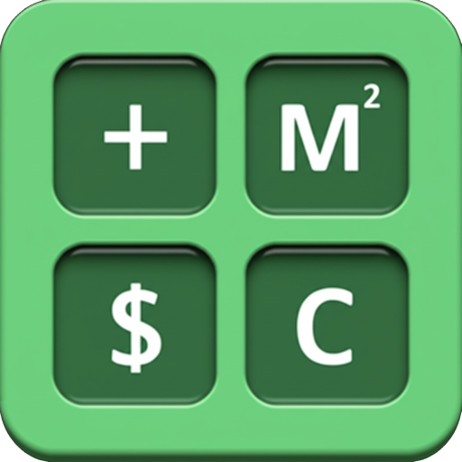

  

<h1 align="center">QCalc</h1>

  <strong>A multi-purpose calculator for productivity and accessibility</strong> — standard · unit · currency · radix · formula 
  Keyboard first, screen-reader friendly, 10 languages. Desktop (Linux · Windows) and Android.

  
  
  
  

  

<a href="README-ko.md">한국어</a>

---

## Why QCalc?

QCalc packs **5 specialized calculators (Standard, Unit, Currency, Radix, Formula)** and **10 languages (한국어, English, 日本語, 中文, हिन्दी, Deutsch, Español, Français, Português, Русский)** into one clean, keyboard-friendly app. Whether you're crunching everyday numbers, converting units, checking exchange rates, working with hex/binary, or evaluating math formulas — it's all one tab away.

- **Built with** — Vue 3 + Quasar + TypeScript + Tauri 2 (desktop) + Capacitor (Android) — the legacy Electron target remains during the transition
- **Runs on** — Windows (NSIS installer), Linux (deb / rpm / AppImage / Snap / Flatpak), Android

---

## Features

### 5 Calculator Modes

| Mode                   | What it does                                                              | Access   |
| ---------------------- | ------------------------------------------------------------------------- | -------- |
| **Standard**           | Arithmetic, percentages, trig, powers, roots, factorial                   | `Ctrl+1` |
| **Unit Converter**     | 15+ categories — length, weight, area, volume, angle, and more            | `Ctrl+2` |
| **Currency Converter** | 340 currencies (fiat, crypto, metals) — no API key needed                 | `Ctrl+3` |
| **Radix Converter**    | Binary / Octal / Decimal / Hex with AND, OR, XOR, NOT, shifts             | `Ctrl+4` |
| **Formula**            | Type math expressions directly using [mathjs](https://mathjs.org/) syntax | `Ctrl+5` |

### Formula Calculator Highlights

- Write expressions like `sqrt(2) * pi`, `sin(45 deg)`, `log(1000)`
- Use `@` to reference the current value, `$` to reference memory
- Inline editor (Space or Enter when empty) for free-form expression editing
- **History navigation** — ↑/↓ arrow keys to browse and reuse previous expressions
- **Load from history** — right-click a formula record to load it back into the formula field
- Built-in help with available functions, constants, and a link to mathjs docs
- Full expression shown in result field and saved to history

### Productivity Tools

- **Calculation History** — search, add notes, export/import as CSV
- **Memory Operations** — MC, MR, MS, M+, M−, M×, M÷
- **Settings Sync** — export/import all settings as JSON
- **Per-Calculator Number Format** — independent grouping, decimal places per mode
- **64-digit Precision** — powered by mathjs BigNumber

### User Experience

- **Themes** — multiple color themes beyond dark/light
- **Adaptive Layout** — history panel auto-appears on wider screens
- **Accessibility** — ARIA labels, screen reader announcement of results (AT-SPI announcements on Linux, aria-live elsewhere), WCAG AA contrast, keyboard focus indicators, reduced motion support
- **Keyboard-first** — every function has a shortcut
- **Mobile** — swipe to switch modes, haptic feedback
- **Always on Top** — pin the calculator above other windows (not available on native Linux Wayland sessions; opt in with `QCALC_FORCE_XWAYLAND=1`)
- **10 Languages** — 한국어, English, 日本語, 中文, हिन्दी, Deutsch, Español, Français, Português, Русский
- **Auto Update** — Windows installer and Linux AppImage update automatically (deb/rpm are manual; Snap/Flatpak update via their stores)

> All translations except Korean were generated by AI. If you notice any errors or have suggestions for improvements, please let us know through [Issues](https://github.com/from104/qcalc/issues).

---

## Keyboard Shortcuts

> **Legend**: `C` = Ctrl, `S` = Shift, `A` = Alt

### Common

| Key         | Action         |
| ----------- | -------------- |
| `0-9` `.`   | Number input   |
| `+ - * /`   | Arithmetic     |
| `Enter` `=` | Calculate      |
| `Backspace` | Delete last    |
| `Delete`    | Clear all      |
| `u` `i`     | x² / √x        |
| `j`         | Toggle sign ±  |
| `k` `%`     | Percentage     |
| `l`         | Reciprocal 1/x |
| `'`         | Shift mode     |

### Shift Mode (Standard)

| Key         | Action                    |
| ----------- | ------------------------- |
| `r` `t`     | xⁿ / ⁿ√x                  |
| `f`         | 10ⁿ                       |
| `g`         | Modulo                    |
| `h`         | Factorial x!              |
| `q` `w` `e` | sin / cos / tan           |
| `z` `x` `c` | π / φ / e                 |
| `a` `s` `d` | π/2 / ln10 / ln2          |
| `v` `b`     | Integer / fractional part |

### Memory

| Key           | Action      |
| ------------- | ----------- |
| `C-Enter`     | Store (MS)  |
| `C-Backspace` | Recall (MR) |
| `C-Delete`    | Clear (MC)  |
| `C-+` `C--`   | M+ / M−     |
| `C-*` `C-/`   | M× / M÷     |

### Unit / Currency (Shift Mode)

| Key         | Action                  |
| ----------- | ----------------------- |
| `a` `s` `d` | ×10 / ×100 / ×1000      |
| `z` `x` `c` | ÷10 / ÷100 / ÷1000      |
| `f` `g` `h` | ×2/×3/×5 or +5/+10/+100 |
| `q` `w` `e` | ÷2/÷3/÷5 or −5/−10/−100 |
| `\`         | Swap source ↔ target    |
| `A-\`       | Toggle symbol display   |

### Programmer (Radix)

| Key                     | Action               |
| ----------------------- | -------------------- |
| `z` `x` `c` `a` `s` `d` | Hex A–F              |
| `j` `k` `l`             | AND / OR / XOR       |
| `h`                     | NOT                  |
| `r` `t`                 | Shift ±1 bit         |
| `f` `g`                 | Shift ±4 bits        |
| `u` `i`                 | Shift ±N bits        |
| `q` `w` `e`             | NAND / NOR / XNOR    |
| `\`                     | Swap source ↔ target |
| `A-\`                   | Toggle radix display |
| `A-C-\`                 | Toggle prefix/suffix |

### Formula (Edit Mode)

| Key      | Action                            |
| -------- | --------------------------------- |
| `Space`  | Enter edit mode                   |
| `Enter`  | Evaluate (or enter edit if empty) |
| `Escape` | Clear expression and exit edit    |
| `↑` `↓`  | Browse expression history         |
| `=`      | Evaluate expression               |

### Navigation & UI

| Key           | Action                                   |
| ------------- | ---------------------------------------- |
| `F1`–`F5`     | Help / About / Settings / History / Tips |
| `C-Tab` `→`   | Next tab                                 |
| `C-S-Tab` `←` | Previous tab                             |
| `C-1`–`C-5`   | Jump to tab                              |
| `Escape`      | Close panel                              |
| `A-t`         | Always on top                            |
| `A-d`         | Dark mode                                |
| `A-n`         | Per-calculator number format             |
| `A-p`         | Haptic feedback                          |
| `,`           | Toggle grouping                          |
| `A-,`         | Grouping unit (3/4)                      |
| `[` `]`       | Decimal places (∞–16)                    |
| `;`           | Toggle extra functions                   |

### Clipboard

| Key     | Action          |
| ------- | --------------- |
| `C-c`   | Copy main panel |
| `S-C-c` | Copy sub panel  |
| `C-v`   | Paste to main   |
| `S-C-v` | Paste to sub    |

### History Panel

| Key           | Action        |
| ------------- | ------------- |
| `↑` `↓`       | Scroll        |
| `PgUp` `PgDn` | Fast scroll   |
| `Home` `End`  | Top / bottom  |
| `C-f`         | Search        |
| `C-[` `C-]`   | Font size −/+ |

---

## Installation

| Platform    | Method                                                                                                                                                        |
| ----------- | ------------------------------------------------------------------------------------------------------------------------------------------------------------- |
| **Windows** | Download NSIS installer from [Releases](https://github.com/from104/qcalc/releases) (auto-update supported)                                                    |
| **Linux**   | `.deb` / `.rpm` / AppImage from [Releases](https://github.com/from104/qcalc/releases) (AppImage auto-updates), Snap (`snap install --beta qcalc`), or Flatpak |
| **Android** | APK from [Releases](https://github.com/from104/qcalc/releases)                                                                                                |

> **Linux package compatibility**: the `.deb` supports Ubuntu 22.04+ / Debian 12+ (and derivatives such as Mint 21+, Pop!\_OS 22.04+); the `.rpm` supports Fedora 37+ and openSUSE Leap 15.6+/Tumbleweed. RHEL/Alma/Rocky 9 and older Debian/Ubuntu are not supported by these packages (glibc/WebKitGTK too old) — use the AppImage (any distro with glibc 2.35+), Flatpak, or Snap instead; those bundle their own runtime.

> **Screen reader users on Linux**: use the `.deb`, `.rpm` or AppImage. Inside the Flatpak sandbox the WebKit UI is currently not exposed to assistive technologies (upstream limitation, [#113](https://github.com/from104/qcalc/issues/113)).

> macOS / iOS builds are not available at this time.

> **Upgrading from 0.12.x or older (Electron)?** On Windows and the AppImage the old app's update check reaches 0.13.1 and installs it for you; on Windows the old installation is removed in the process. Every other package (`.deb`, `.rpm`, Snap, Flatpak) has to be installed by hand. Either way, bring your data over: in the old app export your history (CSV) and settings (JSON), and import them from the new app's first-run screen (or Settings).
>
> 0.13.0 itself was published without the file the old app's updater reads, so an install still on 0.12.x will only be offered 0.13.1 or later.

---

## Contributing

See [CONTRIBUTING.md](CONTRIBUTING.md) for translation and contribution guidelines.

## Development

See [DEVELOP.md](DEVELOP.md) for build instructions and development setup.
